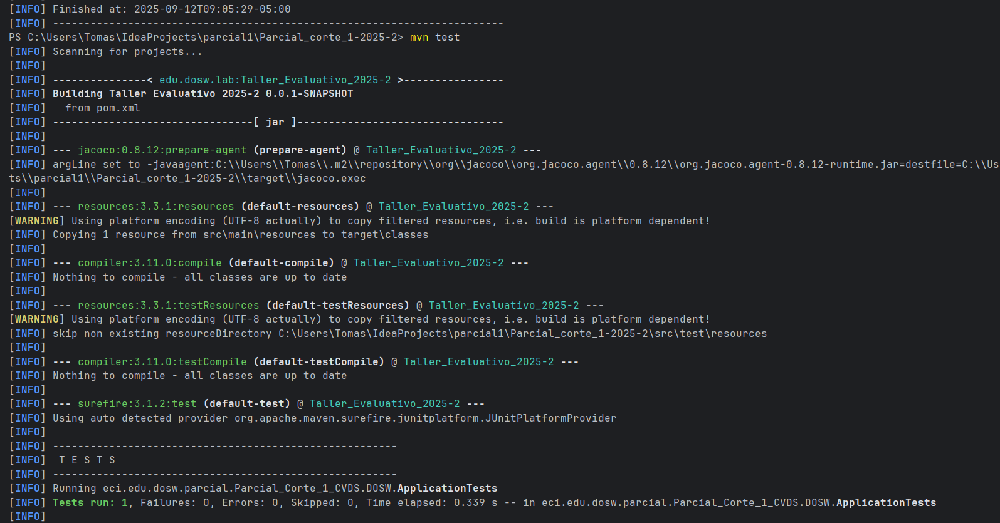
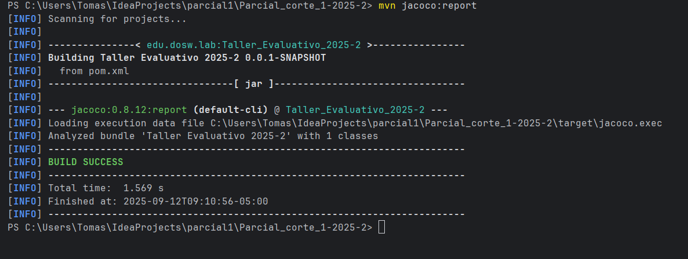
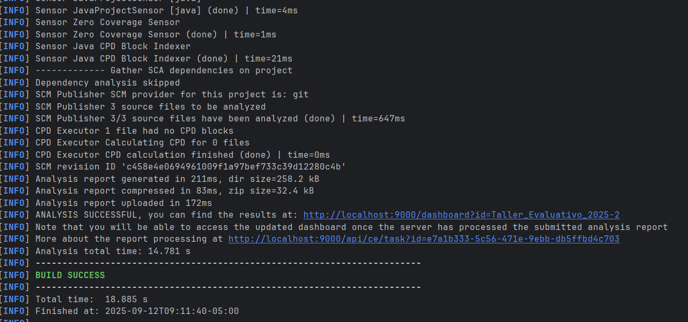
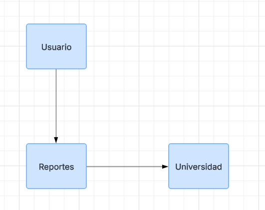
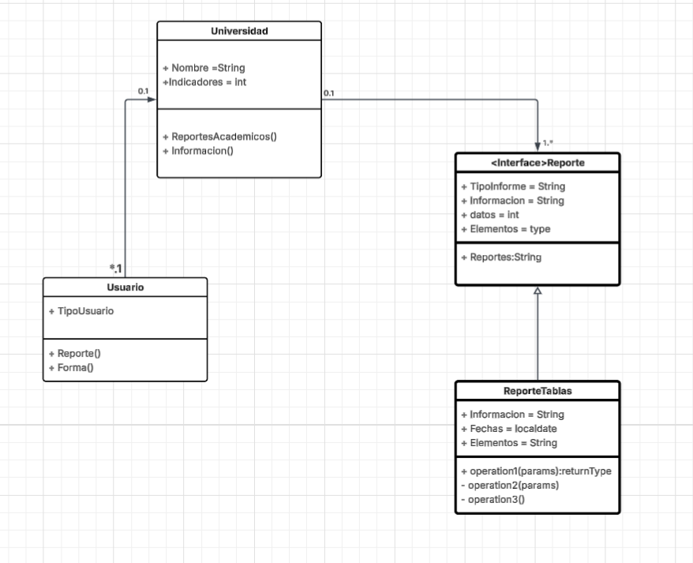

# Parcial_corte_1-2025-2

#### Integrantes
- Tomas Felipe Ramirez Alvarez

### maven Corriendo

### jacoco Corriendo

### sonar Corriendo

-----
1. Identifique por medio de un diagrama de contexto las generalidades de su
   sistema.
- 

----
2. Establezca las funcionalidades presentes en el caso de estudio y desarrolle
   un diagrama de casos de uso.
- 

----
3. Realice un diagrama de clases que permita entender su solución, adicional
   mencione que principios SOLID está aplicando, en que componentes y como
- 
- ### solid
    - En los patrones solid utilizamos tres de ellos:
    - #### Single responsibility principle:
        - Utilisamos la "S" porque cada clase y metodo de las clases se tiene que
          encargar solamente de las peticiones solicitadas en esa instancia
    - #### Open/Closed principle:
        - debido a que es un programa de evolucion lo mejor que se puede hacer es crear
          las clases necesarioas para hacer el comportamiento mas detallado quitando asi el
          acomplamiento y dejando alta cohecion para proximas implementaciones o actualizaciones
    - #### Liskov Substitution:
        - Respecto a las tablas y las caracteristicas visuales el software tiene que estar en
          la capacidad de evoluvionar sin violar los pricipios solid, debido a esto tenemos la
          implementacion de este principio el cual puede seguir evolucionando sin tener que modificar
          lo ya creados
    - Comportamientos de los solid elejidos
        - El primero se encarga de que solo halla una instancia de ese objeto donde otras clases no hagan actividades
          que no les corresponde
        - El segundo nos permite hacer evolucionable el sistema que cada clase sea extensible pero no modificable con el
          fin de hacer el software mas robusto y util
        - El tersero se ve representado en las ultimas dos clases las cuales son interfaces y herencia permitiendo asi
          añadir futuros comportamientos en los reportes sin necesidad de modifcar lo ya hecho esto nos permite respetar los
          otros principios.
          lo ya creados

4. Identifique los 2 patrones de diseño que se están solicitando a implementar
   en el caso de estudio, especificando por cada uno:
   - a. Nombre del Patrón
   - Factory Method
   - Bridge

  - b. Tipo de Patrón (Creacional, Estructural o de Comportamiento).
    - Creacional
    - Estructural
  
  
  - c. Argumentación del porque se utiliza y como se ve reflejado en el diagrama de clases anterior
    - Creacion - Factory Method: se ve reflejado en la clase reportes donde puede crear objetos de la super clase mientras
      permite a las subclases pueden alterar algun tipo de objeto.
    - Estructurales - Bridge: lo vemos complementado con la clase usuario y universidad donde el usuario le solicita a la
      universidad un Reporte con ciertos requisitos aqui se ve como la relacion de se ve en adstraccion e implementacion para
      desarrollar independientemente la ina de la otra

comandos:

mvn compile
mvn test
mvn jacoco:report
mvn sonar:sonar
mvn clean verify sonar:sonar
