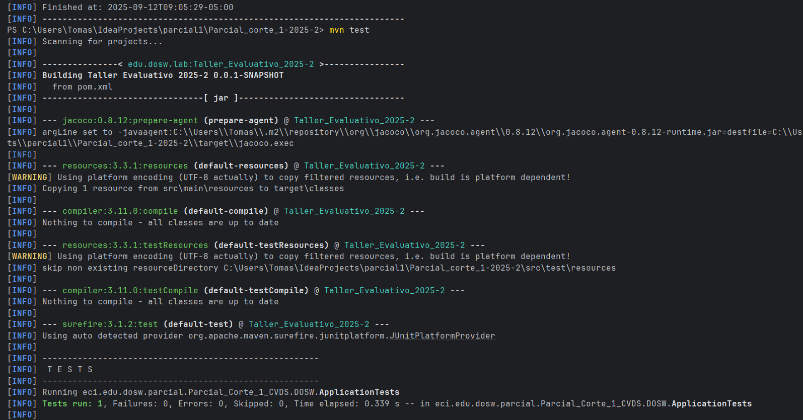
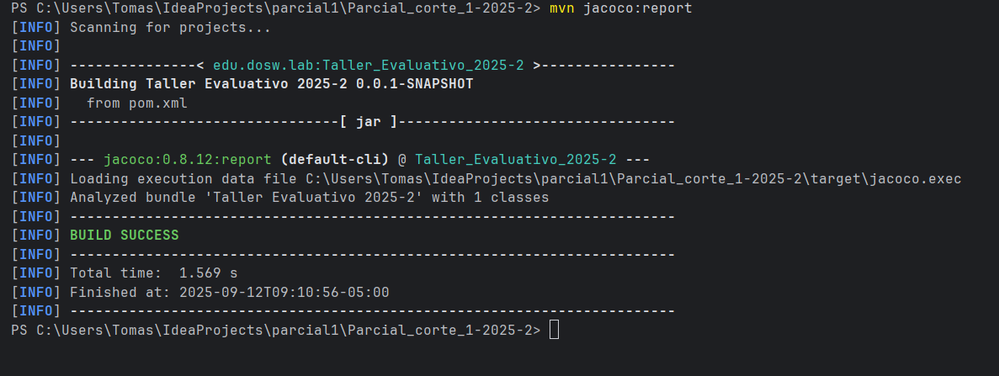

# Parcial_corte_1-2025-2

#### Integrantes
- Tomas Felipe Ramirez Alvarez

### maven Corriendo

### jacoco Corriendo

### sonar Corriendo

-----
1. Identifique por medio de un diagrama de contexto las generalidades de su
   sistema.
- 

----
2. Establezca las funcionalidades presentes en el caso de estudio y desarrolle
   un diagrama de casos de uso.
- 

----
3. Realice un diagrama de clases que permita entender su solución, adicional
   mencione que principios SOLID está aplicando, en que componentes y como
- 
- ### solid
    - En los patrones solid utilizamos tres de ellos:
    - #### Single responsibility principle:
        - Utilisamos la "S" porque cada clase y metodo de las clases se tiene que
          encargar solamente de las peticiones solicitadas en esa instancia
    - #### Open/Closed principle:
        - debido a que es un programa de evolucion lo mejor que se puede hacer es crear
          las clases necesarioas para hacer el comportamiento mas detallado quitando asi el
          acomplamiento y dejando alta cohecion para proximas implementaciones o actualizaciones
    - #### Liskov Substitution:
        - Respecto a las tablas y las caracteristicas visuales el software tiene que estar en
          la capacidad de evoluvionar sin violar los pricipios solid, debido a esto tenemos la
          implementacion de este principio el cual puede seguir evolucionando sin tener que modificar
          lo ya cread

-----
1. Identifique por medio de un diagrama de contexto las generalidades de su
   sistema.
- 

----
2. Establezca las funcionalidades presentes en el caso de estudio y desarrolle
   un diagrama de casos de uso.
- 

----
3. Realice un diagrama de clases que permita entender su solución, adicional
   mencione que principios SOLID está aplicando, en que componentes y como
- 
- ### solid
    - En los patrones solid utilizamos tres de ellos:
    - #### Single responsibility principle:
        - Utilisamos la "S" porque cada clase y metodo de las clases se tiene que
          encargar solamente de las peticiones solicitadas en esa instancia
    - #### Open/Closed principle:
        - debido a que es un programa de evolucion lo mejor que se puede hacer es crear
          las clases necesarioas para hacer el comportamiento mas detallado quitando asi el
          acomplamiento y dejando alta cohecion para proximas implementaciones o actualizaciones
    - #### Liskov Substitution:
        - Respecto a las tablas y las caracteristicas visuales el software tiene que estar en
          la capacidad de evoluvionar sin violar los pricipios solid, debido a esto tenemos la
          implementacion de este principio el cual puede seguir evolucionando sin tener que modificar
          lo ya cread
comandos:

mvn compile
mvn test
mvn jacoco:report
mvn sonar:sonar
mvn clean verify sonar:sonar
